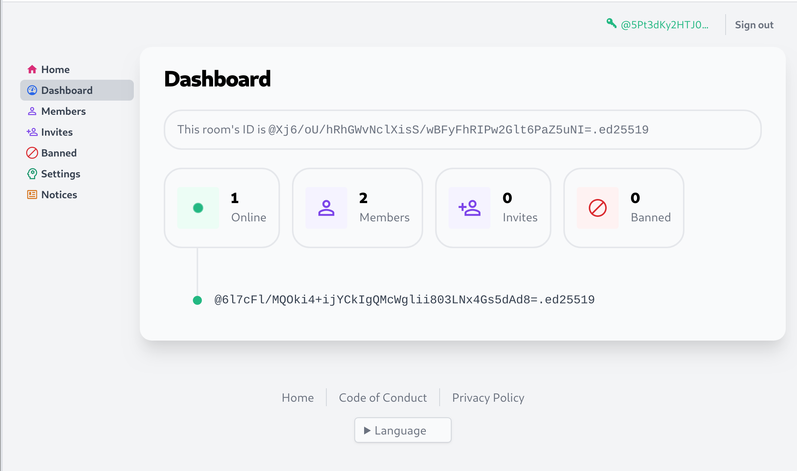

<!--
N.B.: This README was automatically generated by https://github.com/YunoHost/apps/tree/master/tools/README-generator
It shall NOT be edited by hand.
-->

# Scuttlebutt Room for YunoHost

[](https://dash.yunohost.org/appci/app/ssbroom)  

[](https://install-app.yunohost.org/?app=ssbroom)

*[Lire ce readme en français.](./README_fr.md)*

> *This package allows you to install Scuttlebutt Room quickly and simply on a YunoHost server.
If you don't have YunoHost, please consult [the guide](https://yunohost.org/#/install) to learn how to install it.*

## Overview

A Scuttlebutt room is a service for connecting scuttlebutt users.

It includes a web interface for managing who is in the room, creating invites, and creating a code of conduct for the room.

For a comprehensive introduction to rooms 2.0, watch [this video](https://www.youtube.com/watch?v=W5p0y_MWwDE).

### Features

- Rooms v1 (tunnel.connect, tunnel.endpoints, etc.)
- User management (allow- & denylisting + moderator & administrator roles), all administered via the web dashboard
- Multiple privacy modes
- Sign-in with SSB
- HTTP Invites
- Alias management

**Shipped version:** 2.0.6~ynh7

**Demo:** https://hermies.club/

## Screenshots



## Documentation and resources

* Official user documentation: <https://github.com/ssb-ngi-pointer/go-ssb-room/blob/master/README.md>
* Official admin documentation: <https://github.com/ssb-ngi-pointer/go-ssb-room/blob/master/README.md>
* Upstream app code repository: <https://github.com/ssb-ngi-pointer/go-ssb-room>
* YunoHost Store: <https://apps.yunohost.org/app/ssbroom>
* Report a bug: <https://github.com/YunoHost-Apps/ssbroom_ynh/issues>

## Developer info

Please send your pull request to the [testing branch](https://github.com/YunoHost-Apps/ssbroom_ynh/tree/testing).

To try the testing branch, please proceed like that.

``` bash
sudo yunohost app install https://github.com/YunoHost-Apps/ssbroom_ynh/tree/testing --debug
or
sudo yunohost app upgrade ssbroom -u https://github.com/YunoHost-Apps/ssbroom_ynh/tree/testing --debug
```

**More info regarding app packaging:** <https://yunohost.org/packaging_apps>
